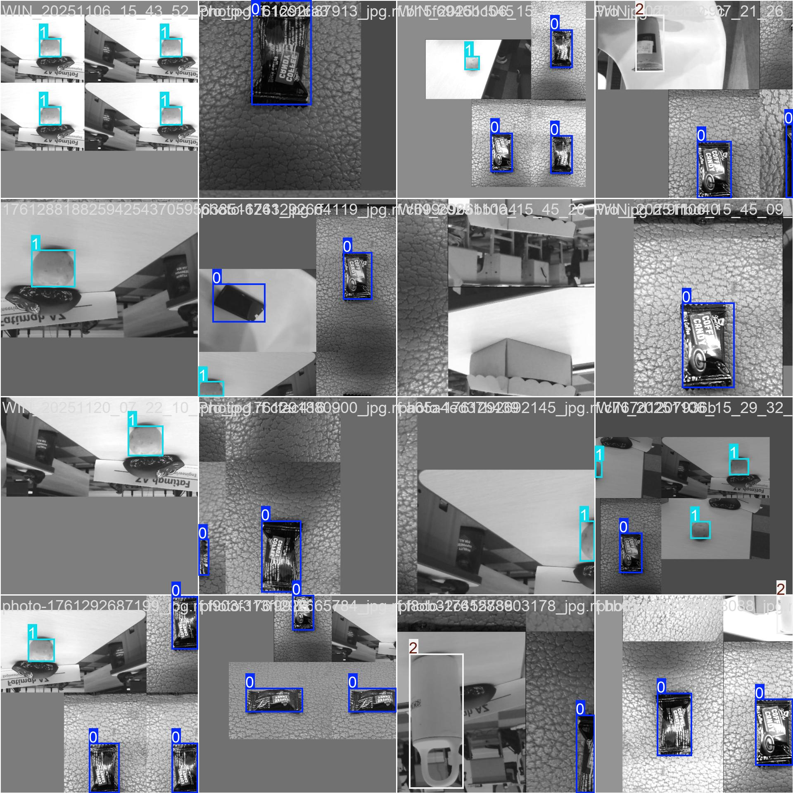

# 🐍 Python OJD – Object Detection (YOLOv8 + Roboflow)

This repository contains an end-to-end Object Detection project (OJD) using **Ultralytics YOLOv8**. The goal is to detect **three shape categories**:

* **Square**
* **Circle**
* **Long Object** (rectangular / elongated shape)

The dataset is prepared and annotated using **Roboflow**, and the training + inference pipeline is built in Python.

---

## 🚀 Features

* Train and run YOLOv8 for custom object detection
* Uses dataset from **Roboflow** (auto-generated YAML)
* Supports detecting multiple geometric shapes

---

## 📂 Project Structure

```
python-ojd/
│
├── data/                 # Roboflow dataset (downloaded automatically)
├── models/               # YOLOv8 models (weights)
├── src/
│   ├── train.py          # Training script
│   ├── predict.py        # Inference script
│   └── utils.py          # Helper functions
│
├── requirements.txt      # Python dependencies
└── README.md             # This file
```

---

## 🧰 Requirements

* Python 3.8+
* Ultralytics YOLOv8
* Roboflow Python SDK (optional)
* OpenCV (for image/video inference)

Install dependencies:

```bash
pip install -r requirements.txt
```

Or manually:

```bash
pip install ultralytics roboflow opencv-python
```

---

## 📥 Download Dataset From Roboflow

Update with your own Roboflow API key and workspace/project details.

```python
!pip install roboflow

from roboflow import Roboflow
rf = Roboflow(api_key="b0Vg********dvK4SoHA")
project = rf.workspace("trial1-xrqmy").project("trial_1-br956")
version = project.version(15)
dataset = version.download("yolov8")
 
```
This will download dataset and YAML to `data/`.
and then need to setup `data.yaml`

```python
names:
- Kotak
- Lingkaran
- Panjang
nc: 3
roboflow:
  license: CC BY 4.0
  project: trial_1-br956
  url: https://universe.roboflow.com/trial1-xrqmy/trial_1-br956/dataset/15
  version: 15
  workspace: trial1-xrqmy
test: D:/TRAINING/Trial_1-15/test/images
train: D:/TRAINING/Trial_1-15/train/images
val: D:/TRAINING/Trial_1-15/valid/images
```

---

## 🏋️ Train YOLOv8 Model

```
!yolo task = detect mode = train model = yolov8s.pt data = Trial_1-11/data.yaml epochs = 10 batch = 128
```

Training output and weights will be saved in `D:\TRAINING\ultralytics\runs\detect\train15\weights\best.pt`.

Here is sample of train batch that conduct by YOLOv8


separately object can be train in 3 categories object ( number 0, number 1, and number 2)

---


## 🔍 Run Object Detection

### Inference on Image

```python
from ultralytics import YOLO

model = YOLO("models/best.pt")
results = model.predict(source="sample.jpg", show=True)
```


### Inference on Webcam

```bash
python src/predict.py --source 0
```

---

## 📝 Example Classes

Your dataset should include labels like:

```
square
circle
long_object
```

Ensure these match the annotations in Roboflow.

---

## 📦 Export Model

```python
model.export(format="onnx")
```

Other export formats supported: TensorRT, CoreML, TFLite.

---

## 📊 Results

You can document:

* mAP performance
* Example predictions
* Notes about performance and future improvements

Add images to the repo (example):

```
results/
   ├── prediction1.jpg
   ├── prediction2.jpg
```

---

## 🧪 Future Improvements

* this methode already implement to detect roller bearing conveyor
* the project can detetc bearing abnormal

---

## 📄 License

MIT License

---


