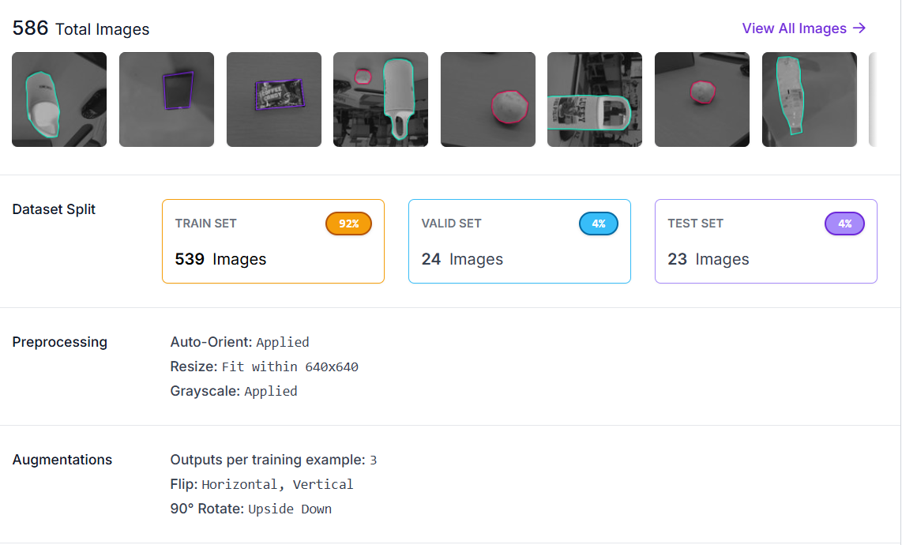
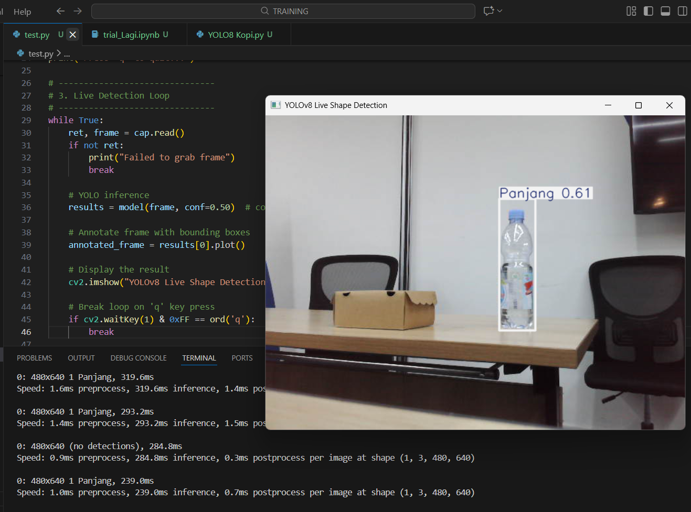
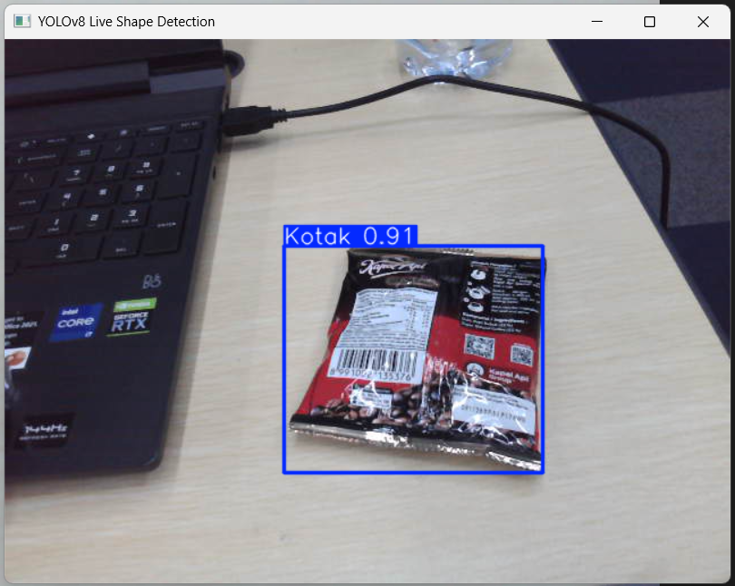
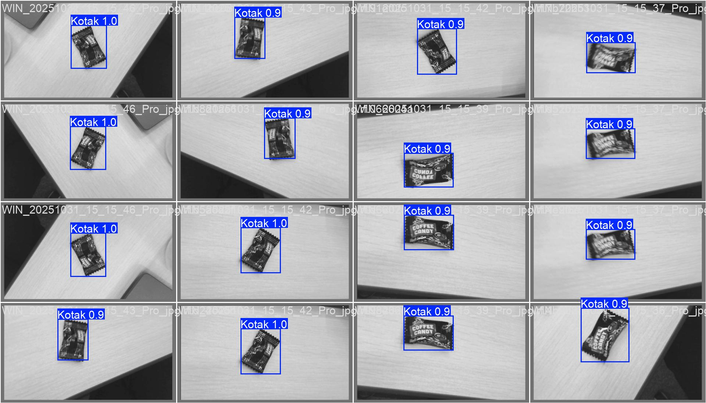

# 🐍 Python OJD – Object Detection (YOLOv8 + Roboflow)

This repository contains an end-to-end Object Detection project (OJD) using **Ultralytics YOLOv8**. The goal is to detect **three shape categories**:

* **Square**
* **Circle**
* **Long Object** (rectangular / elongated shape)

The dataset is prepared and annotated using **Roboflow**, and the training + inference pipeline is built in Python.

---

## 🚀 Features

* Train and run YOLOv8 for custom object detection
* Uses dataset from **Roboflow** (auto-generated YAML)
* Supports detecting multiple geometric shapes

---

## 📂 Project Structure

```
python-ojd/
│
├── data/                 # Roboflow dataset (downloaded automatically)
├── models/               # YOLOv8 models (weights)
├── src/
│   ├── train.py          # Training script
│   ├── predict.py        # Inference script
│   └── utils.py          # Helper functions
│
├── requirements.txt      # Python dependencies
└── README.md             # This file
```

---

## 🧰 Requirements

* Python 3.8+
* Ultralytics YOLOv8
* Roboflow Python SDK (optional)
* OpenCV (for image/video inference)

Install dependencies:

```bash
pip install -r requirements.txt
```

Or manually:

```bash
pip install ultralytics roboflow opencv-python
```

---

## 📥 Download Dataset From Roboflow

First need to download Roboflow API key and workspace/project details.

sample dataset from roboflow 



you can do Dataset Split, Preprocessing, Augmentations before download your datasheet, and confirm Image and Annotation Format `YOLOv8`


```python
!pip install roboflow

from roboflow import Roboflow
rf = Roboflow(api_key="b0Vg********dvK4SoHA")
project = rf.workspace("trial1-xrqmy").project("trial_1-br956")
version = project.version(15)
dataset = version.download("yolov8")
 
```
This will download dataset and YAML to `data/`.
and then need to setup `data.yaml`

```python
names:
- Kotak
- Lingkaran
- Panjang
nc: 3
roboflow:
  license: CC BY 4.0
  project: trial_1-br956
  url: https://universe.roboflow.com/trial1-xrqmy/trial_1-br956/dataset/15
  version: 15
  workspace: trial1-xrqmy
test: D:/TRAINING/Trial_1-15/test/images
train: D:/TRAINING/Trial_1-15/train/images
val: D:/TRAINING/Trial_1-15/valid/images
```

---

## 🏋️ Train YOLOv8 Model

To conduct train dataset use this following script
```
!yolo task = detect mode = train model = yolov8s.pt data = Trial_1-15/data.yaml epochs = 100 batch = 128
```

Training output and weights will be saved in `D:\TRAINING\ultralytics\runs\detect\train15\weights\best.pt`.

Here is sample of train batch that conduct by YOLOv8


separately object can be train in 3 categories object ( number 0, number 1, and number 2)

by this training data we can get best confidence threshold for my model is `0.856`, but for better stabilization during capturing the data I will set to `0.5`
but High precision with fewer false positives → we can use conf=`0.85`

---


## 🔍 Run Object Detection

### setup dataset in program

```python
from ultralytics import YOLO
import cv2
model = YOLO('D:/TRAINING/ultralytics/runs/detect/train16/weights/best.pt')  # Custom trained model path

```

###  setup webcam in program

```python
cap = cv2.VideoCapture(0)  # 0 = default webcam
if not cap.isOpened():
    print("Error: Could not open webcam.")
    exit()

print("Press 'q' to quit...")
```

---

###  setup live detection in program

```python
while True:
    ret, frame = cap.read()
    if not ret:
        print("Failed to grab frame")
        break

    # YOLO inference
    results = model(frame, conf=0.50)  # confidence threshold = 0.5

    # Annotate frame with bounding boxes
    annotated_frame = results[0].plot()

    # Display the result
    cv2.imshow("YOLOv8 Live Shape Detection", annotated_frame)

    # Break loop on 'q' key press
    if cv2.waitKey(1) & 0xFF == ord('q'):
        break

# Cleanup
cap.release()
cv2.destroyAllWindows()
```

---

## 📝 Example of Detection

based on the activity training we can detect models of shape of object :
this is sample of detection long object 


this is sample of detection circle object 


this is sample of detection square object 


Ensure these match the annotations in Roboflow.

---

## 📊 Results

After we conduct training, we get the training result graph that has 8 indication of result value training.

by this result we can get some information like :
1. train/box_loss -> How well YOLO predicts bounding-box positions.
2. train/cls_loss -> how well the model identifies the correct class.
3. train/dfl_loss -> (Distribution Focal Loss) helps refine box borders.
4. metrics/precision(B) -> How accurately the model detects objects.
5. metrics/recall(B) -> How many objects the model successfully finds.
6. metrics/mAP50(B) -> How well predicted boxes overlap ground truth (IoU ≥ 0.5).
7. metrics/mAP50-95(B) -> This is a tougher metric (IoU from 0.5 to 0.95).
8. val/cls_loss shows a spike early

in other words,
🎯 OVERALL EVALUATION OF TRAINING

✔️ Box loss decreasing
✔️ Class loss very low
✔️ DFL loss stable
✔️ Precision near 1.0
✔️ Recall near 1.0
✔️ mAP50 and mAP50-95 near 1.0
✔️ No major instability

👉 The model is extremely well-trained and likely very accurate.


In the bar chart (Left Top), it's that show that data label "kotak" has more rather than "lingkaran" and "panjang", 
thats mean my data set is unbalance, it's also will impact to the other categories value.

the second is about bounding box (right top), mostly data set is in the center of the picture, "persegi" and "lingkaran" has relatif area, but objek "panjang" has more big variation.


in this picture that object "kotak" can be detect more accurate due to data set is more stable. 

---

## 🧪 Future Improvements

* this methode already implement to detect roller bearing conveyor
* 
* the project can detetc bearing abnormal
* 

---

## 📄 License

MIT License

---


